# Pizza Sales Analysis 🍕

## Project Overview
This project focuses on analyzing pizza sales data using SQL and 
MySQL Workbench. The dataset contains information about orders, 
pizza types, sizes, prices, and order details. The goal of this 
project is to derive meaningful business insights from raw sales 
data that can help a pizza business understand its performance, 
identify trends, and make smarter data-driven decisions.

The analysis is divided into three levels — Basic, Intermediate, 
and Advanced — each building on the previous to provide deeper 
insights into the business.

---

## Tools & Technologies Used
- **MySQL** — Database management system used to store and 
  query the data
- **MySQL Workbench** — Visual tool used to write and execute 
  SQL queries
- **SQL (Structured Query Language)** — Primary language used 
  for all data analysis

---

## Database Structure
- **Database Name:** `pizzeria`
- **Tables Used:**
  - `orders` — Stores order ID, date, and time of each order
  - `order_details` — Stores quantity and pizza ID for each order
  - `pizzas` — Stores pizza ID, size, and price information
  - `pizza_types` — Stores pizza name and category information

---

## SQL Concepts Used

### 1. Aggregate Functions
Used to perform calculations on multiple rows and return a 
single value:
- `COUNT()` — To count total number of orders placed
- `SUM()` — To calculate total revenue and total quantities
- `AVG()` — To find average number of pizzas ordered per day
- `ROUND()` — To round revenue values to 2 decimal places

### 2. GROUP BY & ORDER BY
- `GROUP BY` — Used to group results by pizza size, category, 
  hour, and date
- `ORDER BY` — Used to sort results in ascending or descending 
  order to find top performers

### 3. JOINS (Inner Join)
Multiple tables were joined together to combine related data:
- `order_details` joined with `pizzas` to get price per order
- `pizzas` joined with `pizza_types` to get pizza names and 
  categories
- `orders` joined with `order_details` to get date-wise quantities
- Triple joins were used extensively across Basic and 
  Intermediate level queries

### 4. Subqueries & Nested Queries
- Used a subquery inside `FROM` clause to calculate average 
  pizzas ordered per day by first grouping by date and then 
  averaging the result
- Used a scalar subquery inside `SELECT` clause to calculate 
  total revenue for percentage contribution calculation

### 5. Window Functions (Advanced)
- `SUM() OVER (ORDER BY date)` — Used to calculate cumulative 
  revenue generated over time, a running total that increases 
  with each passing date
- `RANK() OVER (PARTITION BY category ORDER BY revenue DESC)` — 
  Used to rank pizzas within each category based on revenue, 
  allowing us to find top 3 pizzas per category

### 6. LIMIT
- Used to restrict results to top N records such as top 5 most 
  ordered pizzas, top 3 revenue pizzas, and highest priced pizza

### 7. HOUR() Function
- Used to extract the hour from the order time to analyze at 
  which hours of the day most orders are placed

---

## Analysis Performed

### Basic Level

**1. Total Orders Placed**
Counted the total number of orders placed using `COUNT(order_id)` 
from the orders table to understand overall business volume.

**2. Total Revenue Generated**
Calculated total revenue by multiplying quantity with pizza price 
across all orders using `SUM()` and `ROUND()` with a JOIN between 
order_details and pizzas tables.

**3. Highest Priced Pizza**
Identified the most expensive pizza on the menu by joining 
pizza_types and pizzas tables and sorting by price in descending 
order with `LIMIT 1`.

**4. Most Common Pizza Size Ordered**
Found the most frequently ordered pizza size by grouping orders 
by size and counting occurrences, then picking the top result.

**5. Top 5 Most Ordered Pizza Types**
Listed the top 5 pizzas by total quantity ordered using a 
triple JOIN across pizza_types, pizzas, and order_details tables 
grouped by pizza name.

---

### Intermediate Level

**6. Total Quantity by Pizza Category**
Joined three tables to find total quantity ordered for each 
pizza category (Classic, Supreme, Veggie, Chicken) to understand 
which category is most popular.

**7. Orders Distribution by Hour**
Used the `HOUR()` function on the order time column to determine 
which hours of the day see the highest order volumes, useful for 
staffing and operations planning.

**8. Category-wise Pizza Distribution**
Counted the number of pizza types available in each category 
using `COUNT(name)` grouped by category.

**9. Average Pizzas Ordered Per Day**
Used a subquery to first calculate total quantity per day, then 
wrapped it in an outer query to calculate the average using 
`AVG()` and `ROUND()`.

**10. Top 3 Pizzas by Revenue**
Identified the three highest revenue-generating pizza types by 
multiplying quantity with price, grouping by pizza name, and 
sorting by revenue in descending order.

---

### Advanced Level

**11. Revenue Percentage by Category**
Calculated what percentage of total revenue each pizza category 
contributes using a scalar subquery to get total revenue and 
dividing each category's revenue by it, multiplied by 100.

**12. Cumulative Revenue Over Time**
Used the window function `SUM() OVER (ORDER BY date)` to 
calculate a running total of revenue across all dates, showing 
how revenue accumulated over the entire period.

**13. Top 3 Pizzas Per Category by Revenue**
Used nested subqueries combined with `RANK() OVER (PARTITION BY 
category ORDER BY revenue DESC)` window function to rank each 
pizza within its category and then filtered results where rank 
is less than or equal to 3.

---

## Results
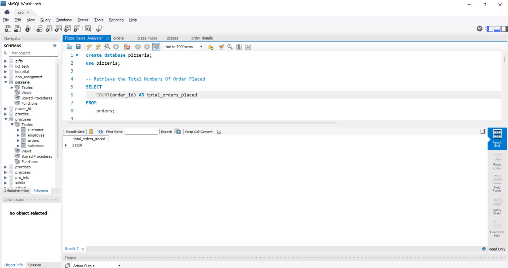
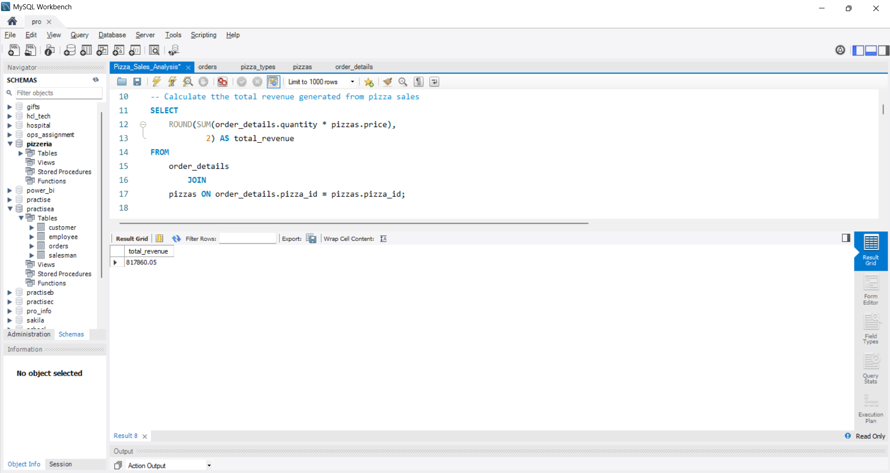
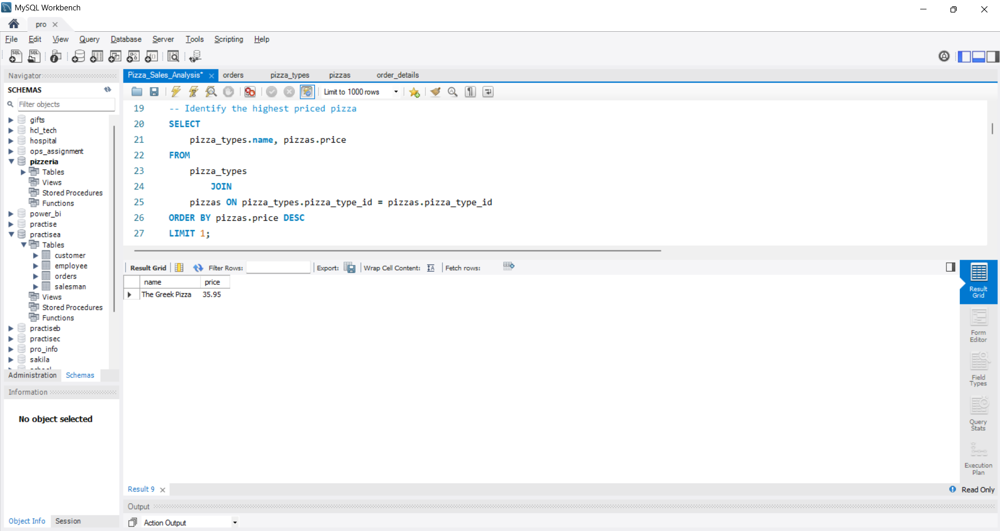
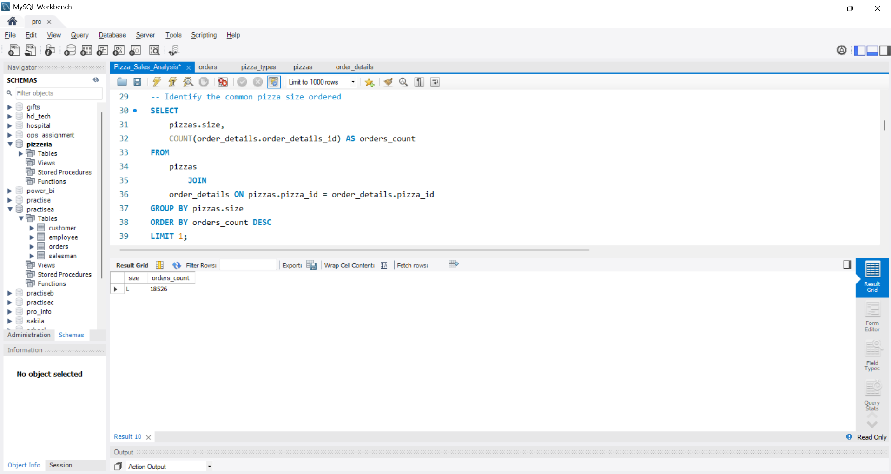
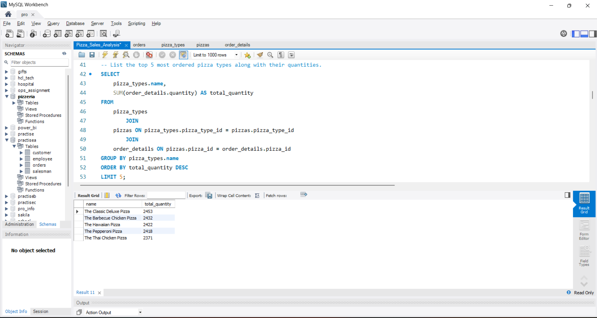
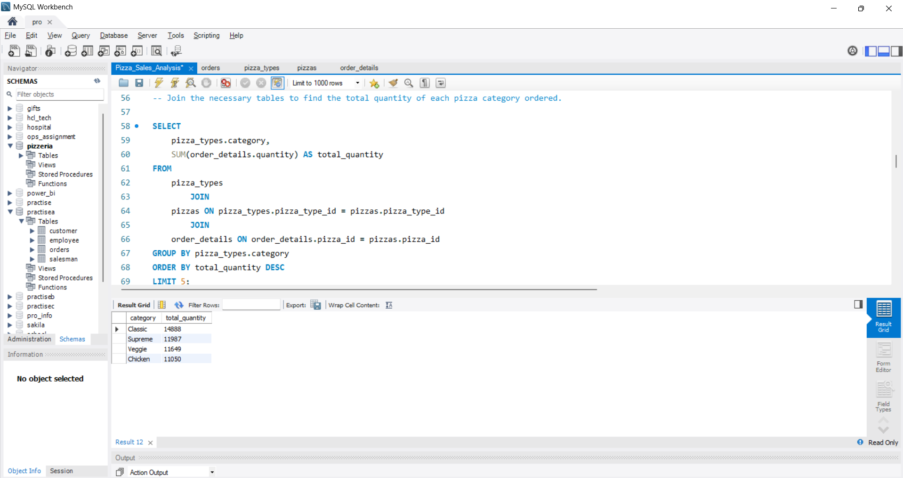
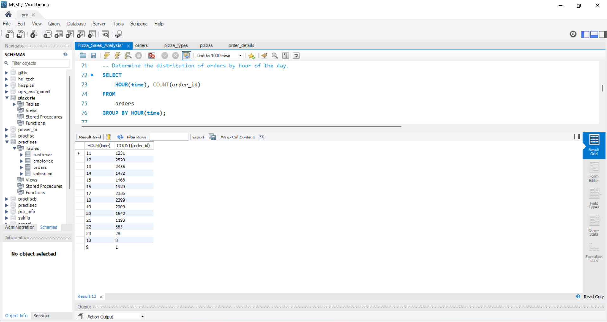
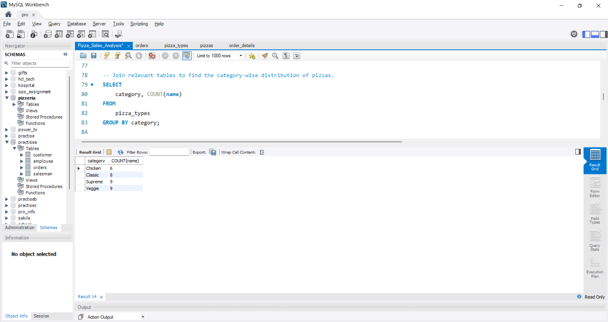
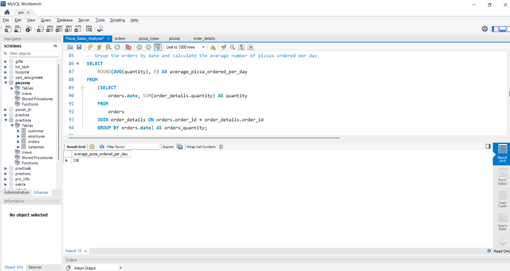
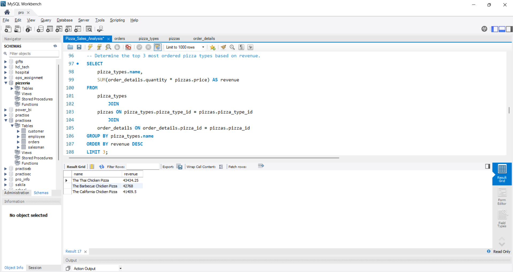
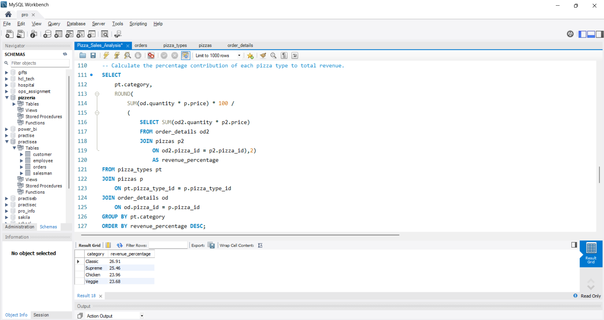
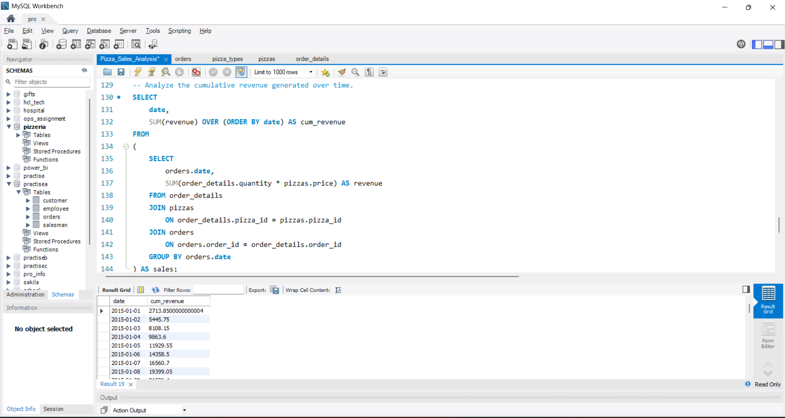
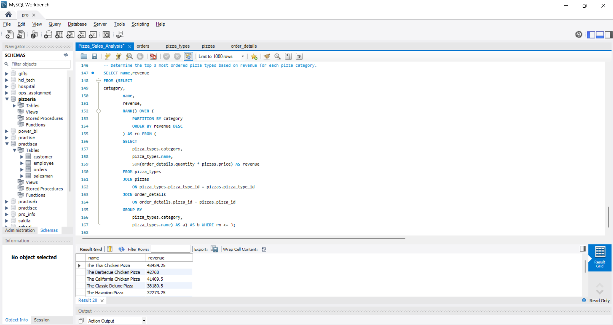

---

## Key Learnings
- Practiced writing complex multi-table JOIN queries
- Learned how to use window functions for advanced analytics
- Understood how subqueries can solve multi-step problems
- Gained experience in breaking down business problems into 
  SQL queries

---

## Author
**Ayushmaan Agrawal**
- GitHub: Ayushmaan-agrawal001
